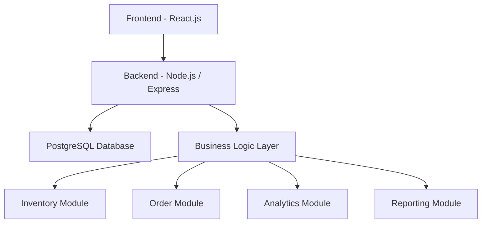

# 🚀 Invexa – Smart Inventory Management System  
### Smart Inventory

---

## 🌟 Overview

Invexa is a full-stack cloud-based Inventory Management System designed to streamline procurement, sales, manufacturing, and financial workflows for small and medium-sized businesses.

The system provides real-time inventory tracking, structured order workflows, and intelligent insights, enabling businesses to operate efficiently and reduce operational errors.

---

## 🎯 Problem vs Solution

| Problem ❌ | Impact 🚨 | Invexa Solution ✅ |
|----------|----------|------------------|
| Manual tracking | High error rates | Automated inventory system |
| Stock mismatch | Inventory loss | Real-time stock updates |
| Disconnected tools | Data inconsistency | Unified platform |
| Poor visibility | Overstock / stockouts | Smart dashboard insights |
| No insights | Poor decisions | AI-powered analytics |

---

## 🔄 Core Workflow


---

## 📦 Features
### 🏗️ Core Business Features

### 📦 Inventory Management
- Multi-warehouse stock tracking
- Product variants (size, color)
- Real-time stock updates 

### 🛒 Order Processing
- Sales & purchase orders 
- Multi-product workflows  
- Order lifecycle management  

### 🏭 Manufacturing (WIP Tracking)
- Bill of Materials (BOM)
- Raw material consumption
- Finished goods generation

### 🔁 Returns & Backorders
- Partial fulfillment tracking
- Reverse logistics

### 🏭 Warehouse Operations
📦 Pick → Pack → Ship workflow
🔄 Inter-warehouse stock transfers
🧪 Quality control & damaged goods tracking
📅 Expiry tracking (FEFO) 

### Financial Features
📊 Customer & vendor ledger
📄 GST invoice generation
💳 Payment tracking 

### 📊 Analytics & Reporting
📈 Dashboard (KPIs, revenue, stock)
📦 Stock movement reports
📉 Profit & loss insights
📊 Historical analytics

### 🛡️ Security & Reliability
🔐 JWT Authentication
👥 Role-Based Access Control (RBAC)
🧾 Audit Trail (full activity logs)

### ⚡ Advanced Backend Features
🔄 Atomic stock operations
🧠 Transaction-safe workflows
🔁 State-controlled order lifecycle
🧩 Service-layer architecture

### 🤖 Intelligence & Innovation
- AI-based insights & forecasting
- NLP command system
- Computer vision inventory audit
- Context-aware recommendations

### 🧾 Compliance & Distributed Systems
- GST calculation & invoice system
- E-Way bill simulation
- CRDT-based distributed sync

### 📩 Notifications & Exports
📧 Email alerts
📄 PDF generation (reports & invoices)

---

## 🏗️ System Architecture



---

## 🛠️ Technology Stack

### Frontend
- React.js (Component-based UI)
- Tailwind CSS (Responsive design)
- Axios

### Backend
- Node.js (Runtime environment)
- Express.js (REST API framework)
- Service Layer Architecture

### Database
- PostgreSQL (Relational database)

### Security
- JWT Authentication
- Role-Based Access Control (RBAC)

---

## ⚙️ How to Run

### 🔹 Prerequisites
- Node.js (v16+)  
- PostgreSQL  

---

### 🔹 Backend Setup
```
cd invexa-backend
npm install
npx prisma db push
npm run dev
```

Runs on: http://localhost:5000  

---

### 🔹 Frontend Setup
```
cd inventory-dashboard
npm install
npm run dev
```

Runs on: http://localhost:5173  

---

## 🔑 Demo Credentials

| Role          | Username   | Password     |
|---------------|------------|--------------|
| Admin         | admin      | password123  |
| Sales         | sales_rep  | test123      |
| Stock Manager | stock_mgr  | test123      |
| Buyer         | buyer      | test123      |
| Factory       | factory    | test123      |
| Dispatch      | dispatch   | test123      |


---


## 📸 Screenshots

### 📊 Dashboard


### 📦 Inventory


## 🎬 Demo Video

Watch the full working demo here:

[▶️ Click to Watch Demo](https://drive.google.com/file/d/1l2ApsnS2Hplz66YTdLRCqpDytXhh_r09/view?usp=drive_link)

---
## 👥 Team

**Team Name:** Dhurandhar  

- Bhoomi Samnotra  
- Avichal Badyal  

---

## 💡 Vision & Impact

Invexa is designed as a **scalable and practical solution** that demonstrates how modern inventory systems can leverage real-time data, automation, and intelligent insights to improve business operations.
