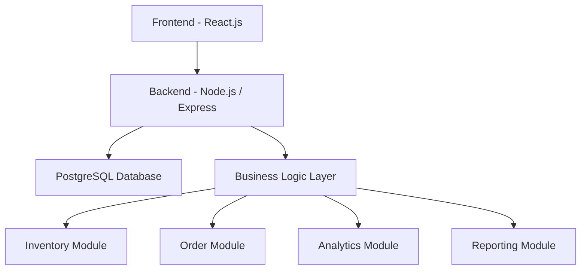

# 🚀 Invexa – Smart Inventory Management System  
### Smart Inventory

---

## 🌟 Overview

Invexa is a **real-time, AI-powered inventory management system** designed to streamline procurement, sales, and operational workflows for small and medium-sized businesses (SMEs).

Traditional inventory systems rely on spreadsheets and disconnected tools, leading to inefficiencies, stock mismatches, and poor decision-making. Invexa eliminates these challenges by providing a **centralized platform** that ensures real-time stock visibility, workflow automation, and improved operational efficiency.

---

## 🎯 Problem vs Solution

| Problem ❌ | Impact 🚨 | Invexa Solution ✅ |
|----------|----------|------------------|
| Manual tracking | High error rates | Automated inventory system |
| Stock mismatch | Inventory loss | Real-time stock updates |
| Disconnected tools | Data inconsistency | Unified platform |
| Poor visibility | Overstock / stockouts | Smart dashboard insights |
| No insights | Poor decisions | AI-powered analytics |

---

## 🔄 Core Workflow


---

## 📦 Features

### 🔹 Inventory Management
- Add, update, and manage products  
- Real-time stock tracking  
- Maintain accurate inventory levels  

### 🔹 Order Processing
- Create and manage sales orders  
- Track order lifecycle from creation to dispatch  
- Seamless integration with inventory  

### 🔹 Real-Time Stock Updates
- Automatic stock deduction upon dispatch  
- Prevents inconsistencies and stock mismatch  
- Ensures accurate inventory visibility  

### 🔹 Dashboard & Insights
- Real-time KPIs and metrics  
- Overview of inventory and order status  
- Enables quick decision-making  

### 🔹 Intelligence Layer (Conceptual)
- Analytics for performance tracking  
- NLP-based command system  
- AI assistant for smart recommendations  

### 🔹 Reporting & Monitoring
- Audit trails for system activity  
- Stock movement tracking  
- Exportable reports and alerts  

---

## 🏗️ System Architecture



---

## 🛠️ Technology Stack

### Frontend
- React.js (Component-based UI)
- Tailwind CSS (Responsive design)

### Backend
- Node.js (Runtime environment)
- Express.js (REST API framework)

### Database
- PostgreSQL (Relational database)

### Security
- JWT Authentication
- Role-Based Access Control (RBAC)

---

## ⚙️ How to Run

### 🔹 Prerequisites
- Node.js (v16+)  
- PostgreSQL  

---

### 🔹 Backend Setup
```
cd invexa-backend
npm install
npm run dev
```

Runs on: http://localhost:5000  

---

### 🔹 Frontend Setup
```
cd inventory-dashboard
npm install
npm run dev
```

Runs on: http://localhost:5173  

---

## 🔑 Demo Credentials

| Role  | Username  | Password     |
|------|----------|-------------|
| Admin | admin     | password123 |
| Sales | sales_rep | test123     |

---


## 📸 Screenshots

### 📊 Dashboard


### 📦 Inventory


---
## 👥 Team

**Team Name:** Dhurandhar  

- Bhoomi Samnotra  
- Avichal Badyal  

---

## 💡 Vision & Impact

Invexa is designed as a **scalable and practical solution** that demonstrates how modern inventory systems can leverage real-time data, automation, and intelligent insights to improve business operations.
